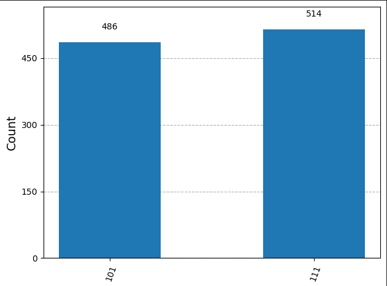

# Quantum Gates Lab: X and H Simulation using Qiskit 🧠⚛️

This is a beginner-friendly quantum circuit simulation using Qiskit.  
It demonstrates how X and H gates behave on different qubits and shows how to visualize quantum measurement outcomes using a histogram.

## 🔍 Output Example

Here’s what the output histogram looks like after 1000 simulations:

## ✨ Features

- 5-qubit quantum circuit
- Uses X (NOT) and H (Hadamard) gates
- Includes barrier visualization
- Measurement on 3 qubits
- Simulated with AerSimulator
- Visual output via histogram

## 🧰 Requirements

- Python 3.8+
- Qiskit
- matplotlib

